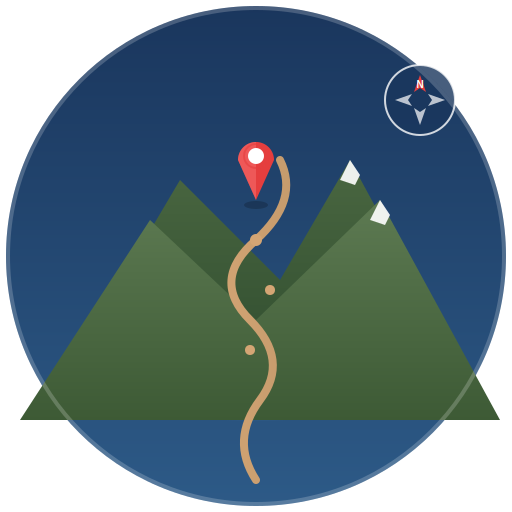

# OpenHiker

<p align="center">
  
</p>

<p align="center">
  <strong>Offline hiking navigation for Apple Watch</strong><br>
  <em>Using free OpenStreetMap cartographic data</em>
</p>

<p align="center">
  <a href="#features">Features</a> •
  <a href="#how-it-works">How It Works</a> •
  <a href="#installation">Installation</a> •
  <a href="#usage">Usage</a> •
  <a href="#roadmap">Roadmap</a> •
  <a href="#building">Building</a> •
  <a href="#license">License</a>
</p>

---

## Why OpenHiker?

Traditional hiking apps require cellular connectivity or expensive offline map subscriptions. OpenHiker brings truly **free, offline topographic maps** directly to your Apple Watch — no phone required on the trail.

Perfect for:
- Backcountry hiking where there's no cell coverage
- Trail running without carrying a phone
- Quick glances at the map without stopping to dig out your phone

## Features

### Offline Maps & Navigation
- **Fully Offline Maps** — Download regions over WiFi, then navigate without any connection
- **Apple Watch Standalone** — Works independently without your iPhone nearby
- **Free Map Data** — Uses [OpenTopoMap](https://opentopomap.org/) tiles based on OpenStreetMap
- **Battery Optimized** — Configurable GPS modes to balance accuracy vs battery life
- **MBTiles Storage** — Efficient SQLite-based tile storage, compact and fast
- **SpriteKit Rendering** — Smooth, responsive map display optimized for watchOS

### Live Hike Metrics & HealthKit
- **Real-Time Stats Overlay** — Distance, elevation gain, duration displayed on the watch during hikes
- **Stats Dashboard** — Dedicated dashboard view with comprehensive hike statistics
- **HealthKit Integration** — Records heart rate, calories burned, and workout sessions
- **Workout Recording** — Automatic HealthKit workout tracking while hiking
- **UV Index Monitoring** — Real-time UV exposure data with sun safety overlay

### Waypoints & Pins
- **Quick Mark on Watch** — Drop pins at points of interest with category presets
- **Full Annotations on iPhone** — Add photos, notes, and categories to waypoints
- **Bidirectional Sync** — Waypoints sync between iPhone and Apple Watch via WatchConnectivity

### Saved Routes & Hike Review
- **Save Completed Hikes** — Persist routes with comprehensive auto-computed statistics (distance, elevation gain/loss, duration)
- **Hike History on iPhone** — Browse past hikes with track overlays and elevation profiles (Swift Charts)
- **Track Compression** — Efficient storage of recorded tracks using the Ramer-Douglas-Peucker algorithm

### Offline Routing Engine
- **A\* Pathfinding** — Fully offline route computation using OSM trail data from Geofabrik
- **Elevation-Aware** — Copernicus DEM GLO-30 elevation data with hiking cost function based on Naismith's rule
- **Compact Routing Graphs** — SQLite-based routing database (~5–20 MB per 50×50 km region)
- **OSM PBF Parsing** — Direct Protocol Buffer parsing of OpenStreetMap extracts

### Route Planning & Turn-by-Turn Guidance
- **Route Planning on iPhone** — Tap start/end/via-points, compute optimal paths, view route stats
- **Turn-by-Turn on Watch** — Route polyline overlay, upcoming turn instructions, haptic feedback
- **Off-Route Detection** — Automatic re-routing when you leave the planned path
- **Hiking & Cycling Modes** — Activity-specific routing with appropriate cost functions

### Multi-Platform & Export
- **iPad Adaptive Layout** — `NavigationSplitView` with sidebar on iPad for a desktop-class experience
- **Native macOS App** — Full-featured planning hub with region selection, tile downloading, route planning, hike review, keyboard shortcuts, and iCloud sync
- **GPX Import** — Import GPX tracks on macOS for review and conversion
- **PDF & Markdown Export** — Generate hike reports with map snapshots and elevation profiles
- **GPX Export** — Standard GPX 1.1 track export from the watch

### Community Route Sharing
- **Browse Shared Routes** — Discover routes shared by the community
- **Upload Your Routes** — Share your planned routes with other hikers
- **iCloud Sync** — Routes, waypoints, and regions sync across your devices via CloudKit

## How It Works

```
┌──────────────────┐          ┌──────────────────┐          ┌──────────────────┐
│   iPhone App     │   ───►   │  Apple Watch     │          │   Mac App        │
│                  │  Watch   │                  │          │                  │
│ • Select region  │ Connect  │ • View map       │          │ • Select region  │
│ • Download tiles │  ivity   │ • GPS tracking   │  iCloud  │ • Download tiles │
│ • Plan routes    │          │ • Turn-by-turn   │ ◄──────► │ • Plan routes    │
│ • Review hikes   │          │ • Live stats     │          │ • Review hikes   │
│ • Community      │          │ • Offline nav    │          │ • Community      │
└──────────────────┘          └──────────────────┘          └──────────────────┘
```

1. **Select** — Use the iOS or macOS app to browse and select a hiking region
2. **Download** — Tiles and optional routing data are fetched and stored in MBTiles/SQLite format
3. **Transfer** — Maps and planned routes are sent to your Apple Watch via Watch Connectivity (iOS) or iCloud sync
4. **Plan** — Create routes on iPhone or Mac with A* pathfinding, then send to watch
5. **Hike** — Navigate offline with real-time GPS, turn-by-turn guidance, and live stats
6. **Review** — Browse past hikes on iPhone, iPad, or Mac with track overlays and elevation profiles

## Installation

### Requirements

- iOS 17.0+ (iPhone/iPad companion app)
- watchOS 10.0+ (Apple Watch app)
- macOS 14.0+ (Mac app)
- Xcode 15.0+

### From Source

```bash
git clone https://github.com/hherb/OpenHiker.git
cd OpenHiker
open OpenHiker.xcodeproj
```

Build and run on your devices using Xcode.

## Usage

### Downloading a Region

1. Open OpenHiker on your iPhone
2. Navigate to the **Regions** tab and browse the map
3. Tap **Select Area** and draw a rectangle around your hiking region
4. Optionally enable routing data download for offline route planning
5. Review the estimated download size and tile count
6. Tap **Download** and wait for completion
7. The region will automatically transfer to your paired Apple Watch

### Planning a Route

1. Navigate to the **Routes** tab on your iPhone
2. Tap **+** and select a downloaded region with routing data
3. Tap on the map to set start, end, and via-points
4. The routing engine computes the optimal path with distance and elevation stats
5. Send the planned route to your Apple Watch

### On the Trail

1. Open OpenHiker on your Apple Watch
2. Select your downloaded region from the **Regions** tab
3. Your current position is shown with a pulsing blue dot
4. Use the Digital Crown to zoom in/out
5. Pan by swiping on the display
6. If following a planned route, turn-by-turn guidance appears with haptic alerts
7. View live stats (distance, elevation, duration) on the overlay
8. Tap to drop waypoint pins at points of interest
9. Save your hike when finished to review later

### GPS Modes

To preserve battery, OpenHiker offers configurable GPS accuracy:

| Mode | Update Interval | Best For |
|------|-----------------|----------|
| High | Continuous | Technical navigation, unfamiliar terrain |
| Balanced | 10 seconds | General hiking |
| Low Power | 30 seconds | Long hikes, battery conservation |

### Reviewing Past Hikes

1. Open OpenHiker on your iPhone, iPad, or Mac
2. Navigate to the **Hikes** tab (or section)
3. Browse your saved hikes with distance, duration, and elevation stats
4. Tap a hike to see the track overlaid on a map with elevation profile
5. Export hikes as PDF or Markdown reports

## Architecture

```
OpenHiker/
├── Shared/                    # Cross-platform code (iOS, watchOS, macOS)
│   ├── Models/                # Data types
│   │   ├── TileCoordinate.swift
│   │   ├── Region.swift
│   │   ├── Waypoint.swift
│   │   ├── SavedRoute.swift
│   │   ├── HikeStatistics.swift
│   │   ├── PlannedRoute.swift
│   │   ├── RoutingGraph.swift
│   │   ├── TurnInstruction.swift
│   │   ├── ActivityType.swift
│   │   └── SharedRoute.swift
│   ├── Storage/               # SQLite data stores
│   │   ├── TileStore.swift
│   │   ├── WaypointStore.swift
│   │   ├── RouteStore.swift
│   │   └── RoutingStore.swift
│   ├── Services/              # Shared business logic
│   │   ├── RoutingEngine.swift
│   │   ├── CloudKitStore.swift
│   │   ├── CloudSyncManager.swift
│   │   ├── GitHubRouteService.swift
│   │   └── HikeSummaryExporter.swift
│   └── Utilities/
│       ├── TrackCompression.swift
│       ├── RouteExporter.swift
│       └── PhotoCompressor.swift
│
├── OpenHiker iOS/             # iPhone & iPad companion app
│   ├── App/                   # Entry point, adaptive layout (TabView / NavigationSplitView)
│   ├── Views/
│   │   ├── RegionSelectorView.swift     # MapKit region selection & download
│   │   ├── TrailMapView.swift           # Trail overlay map display
│   │   ├── HikesListView.swift          # Saved hike history
│   │   ├── HikeDetailView.swift         # Hike detail with track overlay
│   │   ├── ElevationProfileView.swift   # Swift Charts elevation profile
│   │   ├── RoutePlanningView.swift      # A* route planning UI
│   │   ├── RoutePlanningMapView.swift   # MapKit view for route planning
│   │   ├── RouteDetailView.swift        # Planned route detail & transfer
│   │   ├── AddWaypointView.swift        # Waypoint creation with photos
│   │   ├── WaypointDetailView.swift     # Waypoint detail & editing
│   │   ├── WaypointsListView.swift      # All waypoints browser
│   │   ├── CommunityBrowseView.swift    # Browse shared routes
│   │   ├── CommunityRouteDetailView.swift
│   │   ├── RouteUploadView.swift        # Share routes with community
│   │   ├── ExportSheet.swift            # PDF/Markdown export
│   │   └── SidebarView.swift            # iPad sidebar sections
│   └── Services/
│       ├── TileDownloader.swift         # Actor-based tile fetcher with subdomain rotation
│       ├── WatchTransferManager.swift   # WatchConnectivity file sender
│       ├── RegionStorage.swift          # Downloaded region management
│       ├── OSMDataDownloader.swift      # OSM PBF trail data download
│       ├── PBFParser.swift              # Protocol Buffer parser
│       ├── ProtobufReader.swift         # Low-level protobuf reader
│       ├── RoutingGraphBuilder.swift    # Builds routing graphs from OSM data
│       ├── ElevationDataManager.swift   # Copernicus DEM elevation data
│       └── PDFExporter.swift            # PDF report generation
│
├── OpenHiker watchOS/         # Apple Watch standalone app
│   ├── App/                   # Entry point, 4-tab vertically-paged interface
│   ├── Views/
│   │   ├── MapView.swift                # SpriteKit offline map display
│   │   ├── HikeStatsOverlay.swift       # Live stats during hike
│   │   ├── HikeStatsDashboardView.swift # Comprehensive stats dashboard
│   │   ├── NavigationOverlay.swift      # Turn-by-turn guidance overlay
│   │   ├── UVIndexOverlay.swift         # UV exposure sun safety overlay
│   │   ├── AddWaypointSheet.swift       # Quick waypoint creation
│   │   └── SaveHikeSheet.swift          # Save completed hike
│   └── Services/
│       ├── MapRenderer.swift            # SpriteKit tile renderer
│       ├── LocationManager.swift        # GPS tracking & track recording
│       ├── HealthKitManager.swift       # Heart rate, workouts, SpO2
│       ├── UVIndexManager.swift         # Real-time UV index monitoring
│       └── RouteGuidance.swift          # Turn-by-turn navigation engine
│
└── OpenHiker macOS/           # Native macOS planning & review app
    ├── App/                   # Entry point, NavigationSplitView sidebar
    │   └── OpenHikerCommands.swift      # Keyboard shortcuts & menu commands
    ├── Views/
    │   ├── MacRegionSelectorView.swift  # Region selection & tile downloading
    │   ├── MacTrailMapView.swift        # MapKit trail overlay display
    │   ├── MacRegionsListView.swift     # Downloaded regions management
    │   ├── MacRoutePlanningView.swift   # Route planning with A* pathfinding
    │   ├── MacHikesView.swift           # Hike history browser
    │   ├── MacHikeDetailView.swift      # Hike detail with map & profile
    │   ├── MacWaypointsView.swift       # Waypoints table view
    │   ├── MacAddWaypointView.swift     # Waypoint creation
    │   ├── MacPlannedRoutesView.swift   # Planned routes list
    │   ├── MacCommunityView.swift       # Community route browser
    │   ├── MacSettingsView.swift        # App preferences
    │   └── GPXImportHandler.swift       # GPX file import support
    └── Services/
        └── MacPDFExporter.swift         # macOS-specific PDF generation
```

## Building

### Debug Build

```bash
# iOS (iPhone/iPad simulator)
xcodebuild -scheme "OpenHiker" -destination "platform=iOS Simulator,name=iPhone 16 Pro"

# watchOS (Apple Watch simulator)
xcodebuild -scheme "OpenHiker Watch App" -destination "platform=watchOS Simulator,name=Apple Watch Series 10 (46mm)"

# macOS
xcodebuild -scheme "OpenHiker macOS" build
```

### Release Build

```bash
xcodebuild -scheme "OpenHiker" -configuration Release archive
```

## Roadmap

OpenHiker is under active development. Here's what's been completed and what's coming next:

| Phase | Feature | Status |
|-------|---------|--------|
| 1 | Live Hike Metrics & HealthKit | Done |
| 2 | Waypoints & Pins | Done |
| 3 | Save Routes & Review Past Hikes | Done |
| 4 | Custom Offline Routing Engine | Done |
| 5 | Route Planning & Active Guidance | Done |
| 6.3 | Export (PDF/Markdown) | Done |
| 6.2 | iPad Adaptive Layouts | Done |
| 6.4 | iCloud Sync | Done |
| 6.1 | Native macOS App | Done |
| — | Community Route Sharing | Done |

### What's Next

- Polish and bug fixes across all platforms
- Expanded test coverage
- App Store release preparation

See [docs/planning/roadmap.md](docs/planning/roadmap.md) for the full roadmap with technical details.

## Data Sources

All map and routing data is free and globally available:

| Data | Source | License |
|------|--------|---------|
| Map tiles | [OpenTopoMap](https://opentopomap.org/) | CC-BY-SA |
| Trail data | [Geofabrik](https://download.geofabrik.de/) OSM extracts | ODbL |
| Elevation | [Copernicus DEM GLO-30](https://spacedata.copernicus.eu/) | CC-BY-4.0 |

## Contributing

Contributions are welcome! Please feel free to submit a Pull Request.

## Acknowledgments

- [OpenStreetMap](https://www.openstreetmap.org/) — Map data contributors
- [OpenTopoMap](https://opentopomap.org/) — Topographic tile rendering
- [MBTiles Specification](https://github.com/mapbox/mbtiles-spec) — Tile storage format

## License

This project is licensed under the **GNU Affero General Public License v3.0** (AGPL-3.0).

See [LICENSE](LICENSE) for the full license text.

---

<p align="center">
  <sub>Built with SwiftUI, SpriteKit, and a love for the outdoors.</sub>
</p>
